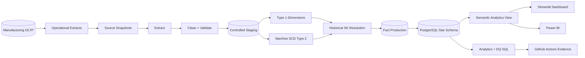
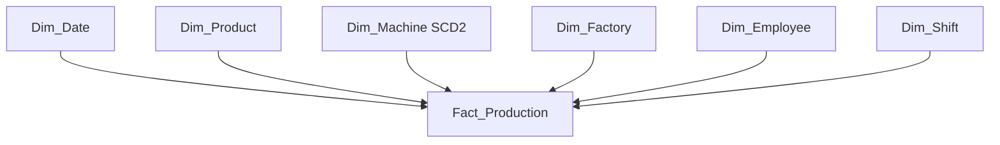

<div align="center">

# Enterprise Manufacturing Data Platform

### Production-minded Data Engineering platform with SCD2, incremental ETL, quality gates, Docker, CI, Streamlit and Power BI

[](https://github.com/th4RUK4/data-warehousing/actions/workflows/milestone5-etl-demo.yml)


</div>

An end-to-end **manufacturing Data Engineering and analytics platform** that combines operational source modelling, controlled staging, dimensional modelling, transactional ETL, Slowly Changing Dimension Type 2, historical surrogate-key resolution, incremental fact loading, data-quality gates, analytics SQL, an interactive dashboard, Dockerized infrastructure and automated CI validation.

> This repository combines the original manufacturing warehouse/dashboard implementation with a stronger shared V2 architecture for portfolio-grade Data Engineering.

**Collaborators:** [@th4RUK4](https://github.com/th4RUK4) · [@akindaG](https://github.com/akindaG)

---

## What this project demonstrates

- normalized OLTP source design
- reproducible source snapshots
- explicit source contracts and validation
- controlled staging tables
- Kimball-style star schema
- PostgreSQL-generated surrogate keys
- Type 1 dimension upserts
- SCD Type 2 history
- date-aware historical surrogate-key resolution
- idempotent incremental fact loading
- warehouse data-quality checks
- analytical SQL and semantic views
- Streamlit + Plotly analytics
- Power BI assets and DAX
- pytest unit tests
- Docker + Docker Compose
- GitHub Actions integration testing and evidence generation

---

# Architecture



### Pipeline

```text
Source state
   │
   ▼
Extract
   │
   ▼
Clean + validate
   │
   ▼
Predefined staging tables
   │
   ├── Type 1 dimension upserts
   └── Machine SCD Type 2
   │
   ▼
Date-aware surrogate-key lookup
   │
   ▼
Idempotent incremental fact load
   │
   ▼
Warehouse quality gates
   │
   ▼
Semantic view + BI
```

---

# Business Problem

Operational manufacturing systems are optimized for recording current activity. Management needs historical and multidimensional answers:

- How is production changing over time?
- Which factory produces the most output?
- Which products contribute the most cost?
- Which machines generate the highest throughput?
- Where are defect rates highest?
- Which shift performs best?
- What factory assignment did a machine have when a historical event occurred?
- Can the same ETL snapshot be replayed without duplicating facts?

The platform converts operational production data into a stable analytical warehouse while preserving business history.

---

# Dimensional Model

## Fact grain

One `Fact_Production` row represents:

> **one completed production event for one product, produced by one machine, handled by one employee, during one shift, at one factory, on one production date**

`Production_ID` is retained as a **degenerate dimension and idempotency key**.



| Measure | Additivity | Purpose |
|---|---|---|
| `Quantity_Produced` | Additive | production volume |
| `Production_Cost` | Additive | manufacturing cost |
| `Production_Time` | Additive across disjoint events | production minutes |
| `Defect_Count` | Additive | defective units |

Calculated analytical measures include:

- `Good_Quantity`
- `Defect_Rate`
- `Cost_Per_Unit`

---

# SCD Type 2

`Dim_Machine` preserves changes to:

- machine name
- machine type
- assigned factory
- machine status

The deterministic two-run scenario demonstrates changed, unchanged and new entities.

| Entity | Run 1 | Run 2 | Behaviour |
|---|---|---|---|
| M001 | F001 | F002 | old version expires and a new version is created |
| M002 | F002 | F002 | current version remains unchanged |
| M003 | absent | F001 | new member inserted |
| Facts | PR001, PR002 | PR003, PR004 | incremental fact load |

### Historical surrogate-key lookup

The fact loader does **not** simply join to `is_current = TRUE`.

It resolves the dimension version valid on the production date:

```sql
WHERE machine_id = :machine_id
  AND effective_date <= :production_date
  AND expiry_date >= :production_date
```

Therefore:

```text
PR001 → historical M001 / F001 version
PR003 → later M001 / F002 version
```

This preserves analytical history after a machine transfer.

---

# Data Quality

Source validation fails fast on:

- missing required columns
- empty datasets
- null business keys
- duplicate business keys
- invalid numeric values
- negative measures
- `defect_count > quantity`
- production dates later than the ETL business date
- invalid source references
- machine/factory inconsistencies

Warehouse-level checks verify:

- unique production transaction IDs
- valid fact measures
- no orphaned surrogate keys
- fact dates inside the linked SCD validity range

See:

```text
analytics/data_quality_checks.sql
```

---

# Technology Stack

| Layer | Technology |
|---|---|
| Source modelling | PostgreSQL OLTP + CSV snapshots |
| ETL | Python 3.12, Pandas, SQLAlchemy |
| Warehouse | PostgreSQL 16 |
| Dimensional modelling | Kimball-style star schema |
| Historical modelling | SCD Type 2 |
| Data quality | Python validation + SQL checks |
| Analytics | SQL + semantic view |
| Interactive BI | Streamlit + Plotly |
| Enterprise BI | Power BI + DAX |
| Tests | pytest |
| Infrastructure | Docker + Docker Compose |
| CI | GitHub Actions |

---

# Repository Structure

```text
.
├── .github/workflows/          Automated platform validation
├── analytics/                  KPI, SCD and data-quality SQL
├── dashboard/                  Streamlit analytics application
├── docs/                       Architecture, contracts and project evolution
├── etl_pipeline/
│   ├── config.py               Environment + source contracts
│   ├── database.py             ETL audit helpers
│   ├── extract.py              Source extraction
│   ├── transform.py            Deterministic cleaning
│   ├── validation.py           Fail-fast quality gates
│   ├── staging.py              Controlled staging loads
│   ├── dimension_loader.py     Type 1 + SCD2 loading
│   ├── fact_loader.py          Historical SK + facts
│   ├── pipeline.py             Transactional orchestration
│   └── run_etl.py              Thin CLI entrypoint
├── oltp_database/              Normalized source-system model
├── powerbi_dashboard/          DAX, theme, exports and build guide
├── source_data/
│   ├── run_1/
│   └── run_2/
├── legacy/v1/                  Original V1 implementation preserved for history
├── tests/                      Unit tests
├── warehouse_database/
│   ├── staging_tables.sql
│   ├── dimension_tables.sql
│   ├── fact_tables.sql
│   ├── warehouse_schema.sql
│   ├── indexes.sql
│   └── analytics_views.sql
├── Dockerfile
├── docker-compose.yml
├── Makefile
├── pyproject.toml
└── requirements.txt
```

---

# Quick Start

## Option A. Docker

Run the full platform:

```bash
docker compose up --build
```

The stack will:

1. start PostgreSQL 16
2. initialize staging, dimensions and facts
3. add star-schema relationships
4. create analytical indexes
5. create the semantic analytics view
6. execute ETL Run 1
7. execute ETL Run 2
8. preserve SCD2 machine history
9. start the Streamlit dashboard

Open:

```text
http://localhost:8501
```

Reset everything:

```bash
docker compose down -v
```

---

## Option B. Local Python + PostgreSQL

### Install

```bash
git clone https://github.com/th4RUK4/data-warehousing.git
cd Enterprise-Manufacturing-Data-Warehouse

python -m venv .venv
source .venv/bin/activate
# Windows: .venv\Scripts\activate

pip install -r requirements.txt
```

### Configure

```bash
cp .env.example .env
```

Never commit a real `.env`.

### Create the warehouse

```bash
psql -U postgres -c "CREATE DATABASE manufacturing_dw;"

psql -U postgres -d manufacturing_dw -f warehouse_database/staging_tables.sql
psql -U postgres -d manufacturing_dw -f warehouse_database/dimension_tables.sql
psql -U postgres -d manufacturing_dw -f warehouse_database/fact_tables.sql
psql -U postgres -d manufacturing_dw -f warehouse_database/warehouse_schema.sql
psql -U postgres -d manufacturing_dw -f warehouse_database/indexes.sql
psql -U postgres -d manufacturing_dw -f warehouse_database/analytics_views.sql
```

### Execute both ETL snapshots

```bash
python -m etl_pipeline.run_etl --source-dir source_data/run_1 --run-date 2026-08-01
python -m etl_pipeline.run_etl --source-dir source_data/run_2 --run-date 2026-08-15
```

### Test and validate

```bash
python -m pytest

psql -U postgres -d manufacturing_dw -f analytics/data_quality_checks.sql
psql -U postgres -d manufacturing_dw -f analytics/scd_verification.sql
psql -U postgres -d manufacturing_dw -f analytics/production_kpi_analysis.sql
```

### Start the dashboard

```bash
streamlit run dashboard/app.py
```

---

# Dashboard

The interactive dashboard consumes:

```text
vw_production_dashboard
```

rather than querying raw source tables.

Features:

- factory filter
- product filter
- machine filter
- date-range filter
- total production
- good units
- defects
- defect rate
- production cost
- cost per unit
- production trend
- production by factory
- product quality analysis
- machine throughput
- production cost distribution
- operational detail table
- CSV export

Database credentials come from environment configuration. No password is hardcoded in the dashboard.

---

# Automated Verification

Every push and pull request validates the platform:

```text
Install dependencies
        ↓
Compile Python
        ↓
Run pytest
        ↓
Provision PostgreSQL 16
        ↓
Create warehouse schema
        ↓
ETL Run 1
        ↓
ETL Run 2
        ↓
Verify SCD Type 2
        ↓
Verify incremental facts
        ↓
Verify historical surrogate keys
        ↓
Run data-quality gates
        ↓
Run analytical SQL
        ↓
Export reproducible evidence
```

The workflow generates:

- ETL run log
- machine history
- semantic dashboard data
- analytical results

---

# Demonstration Results

The deterministic source fixture is intentionally small so correctness is easy to inspect.

| KPI | Result |
|---|---:|
| Production events | 4 |
| Total units | 385 |
| Total defects | 7 |
| Good units | 378 |
| Defect rate | 1.82% |
| Total production cost | 85,000.00 |
| Cost per unit | 220.78 |
| Total production minutes | 425 |

The fixture is a **correctness test**, not a scale benchmark.

---

# Engineering Decisions

### Database-generated surrogate keys

Surrogate keys use PostgreSQL identity columns instead of:

```text
MAX(key) + 1
```

This avoids concurrency collisions and delegates key generation to the database.

### Controlled staging schema

The ETL truncates predefined staging tables and appends validated data. Pandas does not own or recreate the warehouse schema.

### Transactional ETL

One source snapshot is processed inside a SQLAlchemy transaction. A failed load does not leave a partially updated warehouse.

### Idempotent facts

`Production_ID` is unique in the warehouse and fact inserts use conflict-safe logic.

### Semantic analytics layer

`vw_production_dashboard` gives BI tools one stable analytical contract while preserving the dimensional model underneath.

### SCD effective-date limitation

The academic snapshots do not expose source CDC timestamps, so `run_date` acts as the machine-version effective business date.

A production implementation would derive this from:

- source `updated_at`
- CDC metadata
- event time
- transaction-log position

---

# Power BI

The repository already contains:

```text
powerbi_dashboard/
├── README.md
├── build_guide.md
├── data_exports/
├── measures.dax
└── theme.json
```

The Streamlit dashboard provides a runnable open analytics layer. Power BI remains the enterprise visualization target for the academic deliverable.

---

# Portfolio Roadmap

The next extensions are intentionally focused on deeper Data Engineering evidence rather than adding technologies only for appearance:

- million-row synthetic workload generator
- `EXPLAIN ANALYZE` performance benchmark
- partitioning strategy
- dbt analytics models and tests
- Airflow orchestration
- AWS deployment
- object-storage raw/bronze layer
- observability and pipeline metrics
- Power BI `.pbix` + screenshots

---

# Project Evolution

The project keeps its academic warehouse foundations while evolving into a shared engineering portfolio. Original V1 code is preserved in `legacy/v1/`, while supporting BI material remains in:

```text
docs/
legacy/v1/
powerbi_dashboard/
```

The V2 architecture extends beyond the minimum assignment requirements while preserving the original evidence and modelling rationale.

---

## Collaborators

- [@th4RUK4](https://github.com/th4RUK4)
- [@akindaG](https://github.com/akindaG)

This repository is maintained as a shared Data Engineering portfolio project. Feature work is developed through branches and pull requests so both contributors retain visible commit, review and collaboration history.
